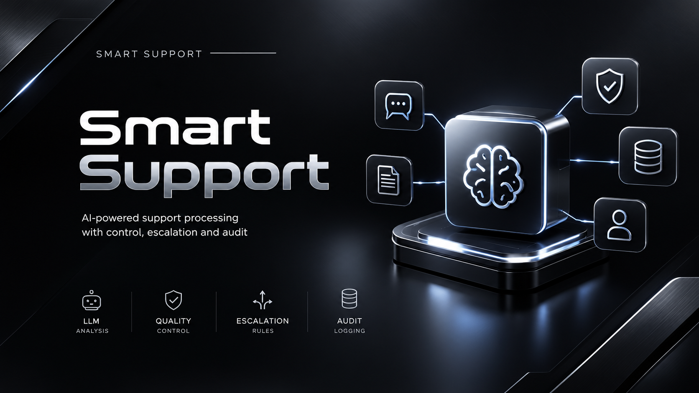
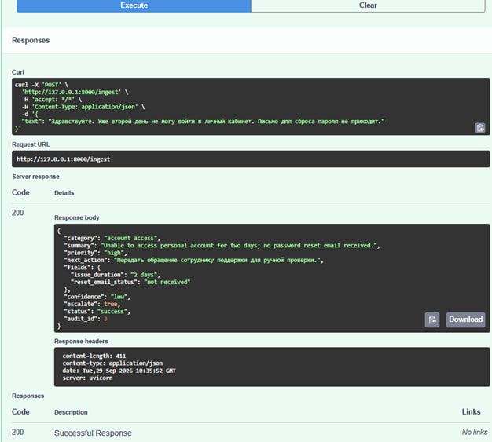
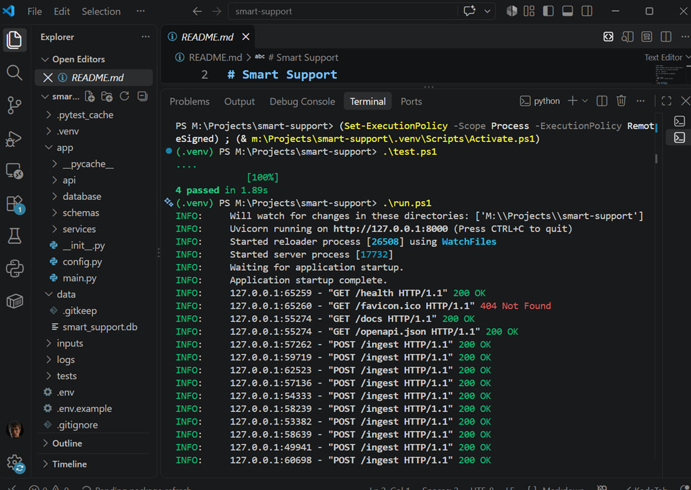

<p align="center">
  <a href="https://github.com/igormikt/smart-support">
    
  </a>
</p>

# Smart Support

MVP-автоматизация процесса обработки обращений клиентов с использованием LLM.

**Кейс:** Process Support / Процесс поддержки  
**Python:** 3.11.9  
**ОС:** Windows 11  
**IDE:** VS Code 1.134.0  
**Shell:** PowerShell  
**API:** FastAPI  
**LLM:** GPT-4o-mini через ProxyAPI  
**Database:** SQLite  
**License:** MIT

---

<p align="center">
  <a href="https://github.com/igormikt/smart-support">
    
  </a>
</p>

<p align="center">
  <a href="https://github.com/igormikt/smart-support">
    
  </a>
</p>

<p align="center">
  <a href="https://github.com/igormikt/smart-support">
    
  </a>
</p>


## 1. О проекте

Smart Support автоматизирует обработку обращений клиентов по схеме:

```text
Обращение клиента
        ↓
    POST /ingest
        ↓
      LLM
        ↓
Structured JSON
        ↓
Валидация и контроль качества
        ↓
Эскалация при необходимости
        ↓
SQLite + Audit Log

2. Возможности

Система формирует:

category — категория обращения;
summary — краткое резюме;
priority — приоритет;
next_action — следующее действие;
fields — извлечённые данные;
confidence — уровень уверенности;
escalate — необходимость передачи человеку.

Контроль качества включает:
валидацию JSON по схеме;
проверку обязательных полей;
проверку допустимых значений;
обработку недостатка данных;
эскалацию при confidence=low;
эскалацию при невалидном JSON;
сохранение результата в журнале.

3. Структура проекта
smart-support/
│
├── app/
│   ├── main.py
│   ├── config.py
│   ├── schemas.py
│   ├── llm.py
│   ├── database.py
│   └── services.py
│
├── data/
│   └── smart_support.db
│
├── inputs/
├── tests/
│
├── .env
├── .env.example
├── .gitignore
├── requirements.txt
├── run.ps1
├── test.ps1
├── README.md
└── LICENSE


5. Локальный запуск

Перейти в каталог проекта: cd "M:\Projects\smart-support"

Активировать виртуальное окружение: .\.venv\Scripts\Activate.ps1

После активации: (.venv) PS M:\Projects\smart-support>

Если PowerShell блокирует запуск: 
Set-ExecutionPolicy -Scope Process -ExecutionPolicy Bypass
Затем:  .\.venv\Scripts\Activate.ps1

6. Установка зависимостей
После активации .venv:
python -m pip install -r requirements.txt
Проверка:  python -m pip list

7. Настройка .env
В проекте используется файл:
.env
Пример:
PROXY_API_KEY=your_proxy_api_key
PROXY_API_BASE_URL=your_proxy_api_url
MODEL=gpt-4o-mini
TEMPERATURE=0.2

8. Запуск приложения
Запустить: .\run.ps1
Ожидается: Uvicorn running on http://127.0.0.1:8000
Проверить API: http://127.0.0.1:8000/health
Открыть Swagger: http://127.0.0.1:8000/docs

9. Проверка POST /ingest
В Swagger найти: POST /ingest
Нажать: Try it out
Ввести обращение:
{
  "text": "Здравствуйте. Хочу узнать статус моего заказа №4582."
}
Нажать:  Execute

10. Ожидаемый результат
API должен вернуть структурированный JSON примерно такого вида:
{
  "category": "order_status",
  "summary": "Клиент хочет узнать статус заказа.",
  "priority": "medium",
  "next_action": "Проверить статус заказа.",
  "fields": {
    "order_id": "4582"
  },
  "confidence": "medium",
  "escalate": false
}
Фактические значения могут отличаться в зависимости от ответа модели.

11. Значения JSON
category
Категория обращения.
Например:
order_status
account_access
payment
delivery
technical_issue
summary

Краткое описание обращения клиента.
priority
Приоритет:
low
medium
high
next_action

Следующее действие по обращению.

fields  Данные, которые удалось извлечь из текста.

confidence  Уровень уверенности:
high
medium
low
Это уровень уверенности, а не процент вероятности.
escalate Определяет, требуется ли передача обращения человеку:
false — обычная обработка
true  — ручная проверка
12. Контроль качества

Основная логика:

LLM
 ↓
JSON
 ↓
Schema Validation
 ↓
Confidence / Data Check
 ↓
Escalation Rule
 ↓
SQLite

Правила:
confidence = low
      ↓
escalate = true
Также:
Недостаточно данных
        ↓
escalate = true
или:
Невалидный JSON
        ↓
escalate = true

Эскалация означает передачу обращения менеджеру для ручной проверки.

13. Проверка эскалации
Для проверки можно отправить:
Здравствуйте. У меня проблема с заказом. Помогите разобраться.
В запросе недостаточно информации.
Это позволяет проверить сценарий:
Недостаточно данных
        ↓
confidence = low
        ↓
escalate = true

14. SQLite и Audit Log
Результаты сохраняются в:
data\smart_support.db

Основная таблица:
audit_logs
Журнал нужен для хранения истории обработки.
В нём можно проверить:
исходное обращение;
результат обработки;
статус;
confidence;
escalate;
ошибку, если она возникла;
идентификатор обработки.

Таким образом можно показать полный путь:
Вход
 ↓
LLM
 ↓
JSON
 ↓
Контроль
 ↓
SQLite

15. Проверка 10 тестовых входов
Для выполнения критерия:
процесс работает на 10 тестовых входах
не нужно открывать 10 окон браузера.
Используется один Swagger:  http://127.0.0.1:8000/docs
Последовательно выполнить 10 запросов:
POST /ingest
Примеры:
1 Здравствуйте. Хочу узнать статус заказа №4582.
2 Не могу войти в личный кабинет.
3 Письмо для сброса пароля не приходит.
4 Оплата заказа ещё не отображается.
5 Когда будет доставлен мой заказ №5310?
6 Как оформить возврат товара?
7 При оформлении заказа появляется ошибка.
8 Подскажите телефон службы поддержки.
9 У меня проблема с заказом. Помогите разобраться.
10 В личном кабинете заказ №4582 находится в обработке.

После выполнения проверить записи в:
data\smart_support.db
таблица:
audit_logs

16. Автоматические тесты
Запуск:
.\test.ps1
или:
python -m pytest -q
Текущие технические тесты должны завершаться без ошибок.
Например:
4 passed
Автоматические тесты проверяют техническую работу приложения.
10 тестовых обращений дополнительно проверяют работу бизнес-процесса.

17. System Prompt
Системный промпт задаёт правила обработки:
не придумывать факты;
использовать только информацию из входа;
возвращать структурированный JSON;
соблюдать заданную схему;
при недостатке информации снижать confidence;
использовать эскалацию при необходимости.
Главное правило:
Не добавлять факты, которых нет во входном обращении.

18. Temperature
Для классификации и структурирования используется: temperature = 0.2
Низкая температура выбрана для повышения стабильности и повторяемости результатов.

Рекомендуемый порядок:

1. Запустить проект
        ↓
2. Открыть Swagger
        ↓
3. POST /ingest
        ↓
4. Ввести обращение
        ↓
5. Execute
        ↓
6. Показать JSON
        ↓
7. Показать confidence / escalate
        ↓
8. Открыть SQLite
        ↓
9. Показать audit_logs

Для демонстрации контроля качества желательно показать:
Обычный случай:
confidence = medium/high
escalate = false
Случай эскалации:
confidence = low
escalate = true


Лицензия
Проект распространяется под:
MIT License
Полный текст лицензии находится в: LICENSE

Итог
Smart Support реализует MVP-процесс:

Вход
 ↓
LLM
 ↓
Structured JSON
 ↓
Validation
 ↓
Quality Control
 ↓
Escalation / Continue
 ↓
SQLite
 ↓
Audit Log

Проект демонстрирует автоматизацию обработки обращений при сохранении контроля человека над неоднозначными случаями.

License: MIT

Author: IGOR_M
Project: Smart Support
Repository: smart-support
